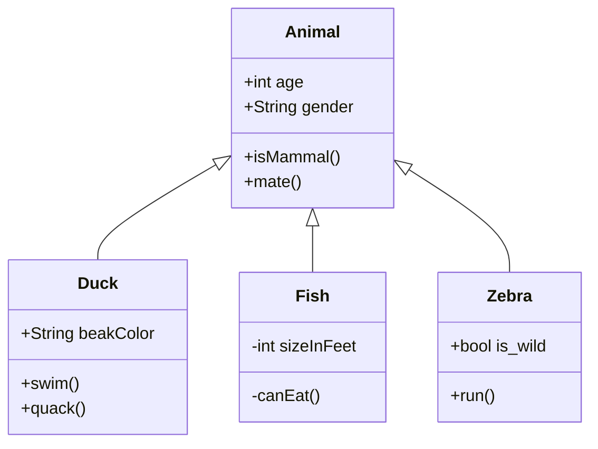

import { Code } from '@astrojs/starlight/components';

import { SaveFile } from "starlight-save-file-component";

Hello world

<Code code={`import math
math.floor(3)`} lang="py"/>

<SaveFile title="Compose file" href="../../../../public/download-files/docker-compose.yml" />

